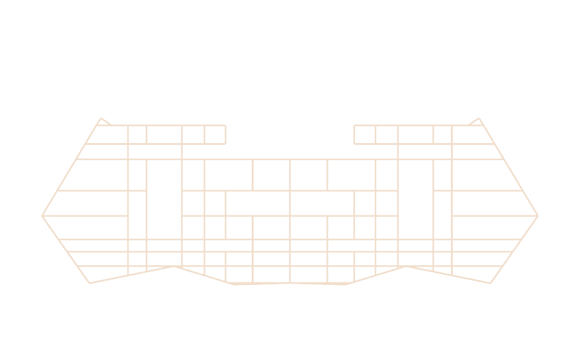

# single benchmark

on `polyXY.json`, which contains slightly overlapping 96 polygons.




extracted from `union.3dm` via `rhinoToJson.fsx`


```bash
node bench.mjs
```

Benchmarks `clipper2-ts`, `clipper2-wasm`, `Klip`, and `LipPerf` against the
same polygon set.

result

```
Loaded 96 polygons for clipper2-ts (96 paths)
Loaded 96 polygons for clipper2-wasm (96 paths)
Loaded Klip paths for clip precisions 4
┌─────────┬───────────┬─────────────────┬────────────┬──────────┬────────────────┬─────────┬──────────┬───────────────┐
│ (index) │ precision │ engine          │ ops/s      │ avg ms   │ vs clipper2-ts │ samples │ polygons │ area          │
├─────────┼───────────┼─────────────────┼────────────┼──────────┼────────────────┼─────────┼──────────┼───────────────┤
│ 0       │ 4         │ 'clipper2-ts'   │ '10375.21' │ '0.0964' │ '1.00x'        │ 4970    │ 1        │ '1254.198274' │
│ 1       │ 4         │ 'clipper2-wasm' │ '23793.69' │ '0.0420' │ '2.29x'        │ 11751   │ 1        │ '1254.198274' │
│ 2       │ 4         │ 'LipPerf'       │ '13696.79' │ '0.0730' │ '1.32x'        │ 6599    │ 1        │ '1254.198274' │
│ 3       │ 4         │ 'Klip'           │ '13802.38' │ '0.0725' │ '1.33x'        │ 6675    │ 1        │ '1254.198274' │
└─────────┴───────────┴─────────────────┴────────────┴──────────┴────────────────┴─────────┴──────────┴───────────────┘
```

